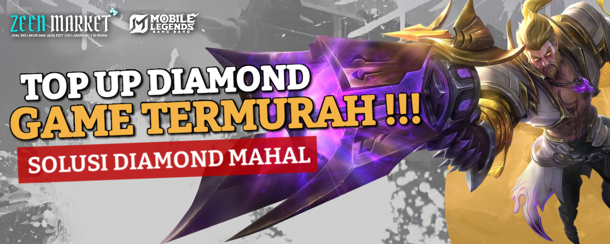
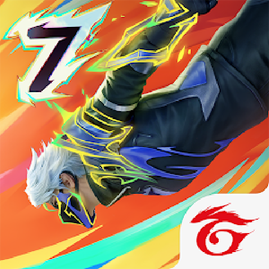
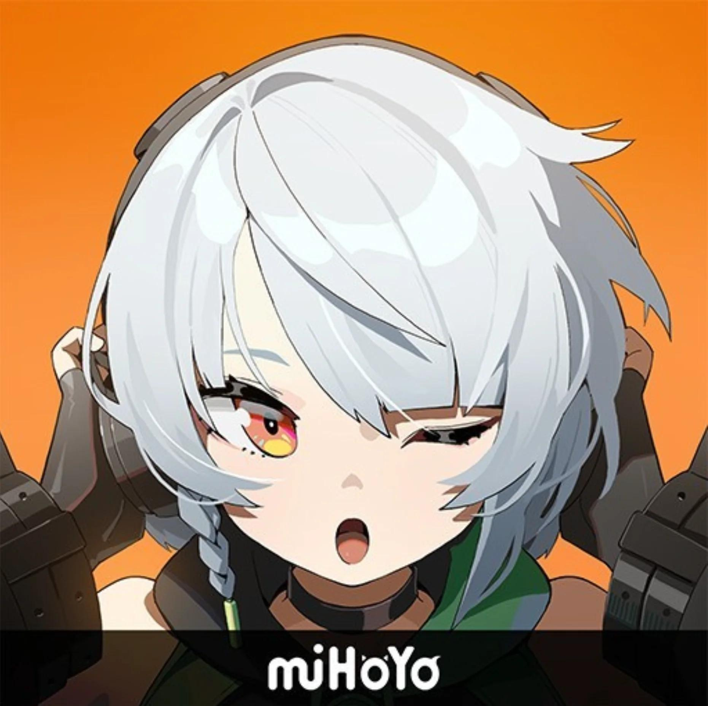
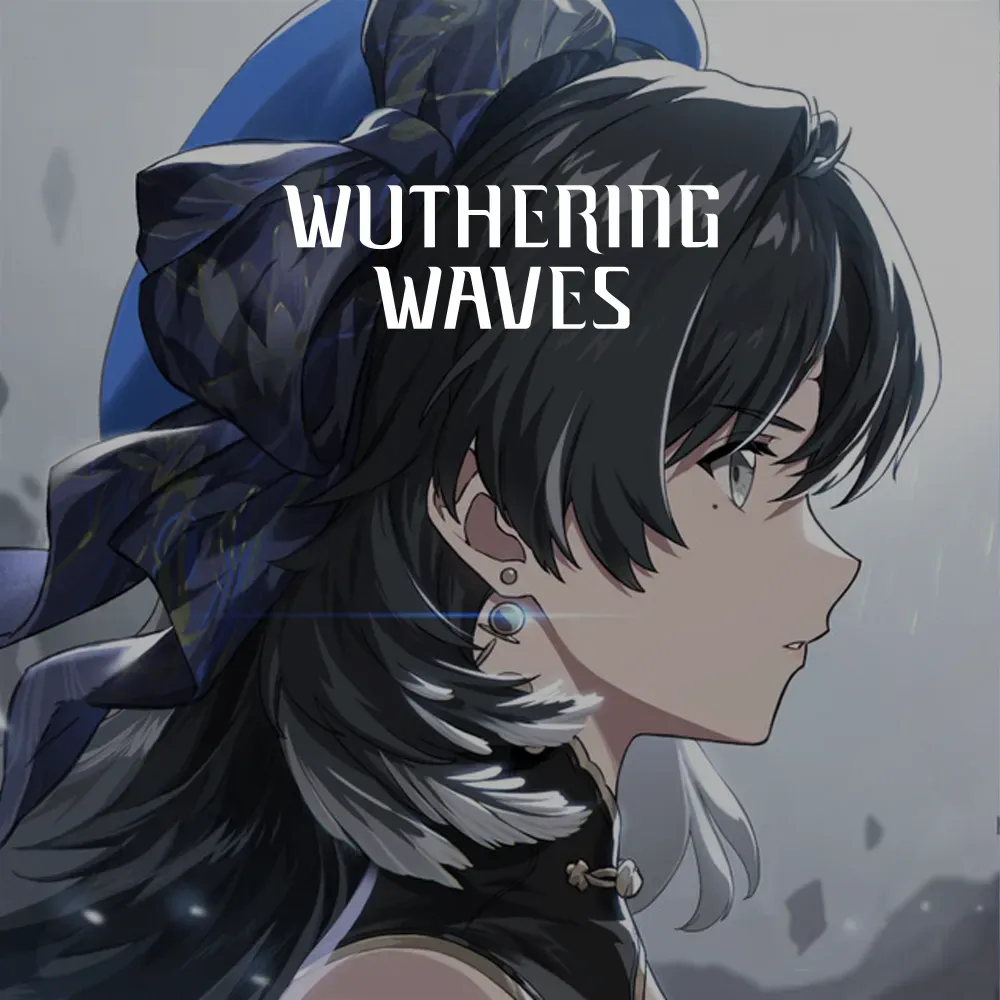

<!DOCTYPE html>
<html lang="id">
<head>
    <meta charset="UTF-8">
    <title>Top Up Game Murah & Resmi | Zeen Market</title>
    <meta name="viewport" content="width=device-width,initial-scale=1.0">
    <link href="https://fonts.googleapis.com/css2?family=Poppins:wght@500;700&display=swap" rel="stylesheet">
    
</head>
<body>
    

        <!-- BRAND HEADER, ZEEN MARKET + SEARCH BOX + JUAL AKUN + JOKI AKUN + LAINNYA -->
        

            

                
            

            Zeen Market
            

                

                    <input type="text" id="searchInput" placeholder="Cari game...">
                    &#128269;
                

                <a href="https://wa.me/6282328581304" target="_blank" class="btn-jual-akun">Jual Akun</a>
                <a href="https://wa.me/6282328581304" target="_blank" class="btn-joki-akun">Joki</a>
                <a href="https://wa.me/6282328581304" target="_blank" class="btn-joki-akun">Lainnya</a>
            

        

        

            

                
Top Up Game Resmi, Murah & Cepat

                
Pilih game kesayanganmu dan lakukan top up dengan aman & mudah!

            

        

        

            <button class="category-btn active" data-category="all">Semua</button>
            <button class="category-btn" data-category="populer">Akun Mlbb</button>
            <button class="category-btn" data-category="mlbb">Akun Free Fire</button>
            <button class="category-btn" data-category="ff">Free Fire</button>
        

        <!-- Banner Slider -->
        

            
            
            
        

        <!-- Titik 3 (dots) di bawah gambar/banner -->
        

        

            

                
                Mobile Legends
                <button class="btn-topup" onclick="window.location.href='ml.html'">Top Up</button>
            

            

                
                Free Fire
                <button class="btn-topup" onclick="window.location.href='topup-ff.html'">Top Up</button>
            

            

                
                PUBG Mobile
                <button class="btn-topup" onclick="window.location.href='topup-pubgm.html'">Top Up</button>
            

            

                
                Valorant
                <button class="btn-topup" onclick="window.location.href='topup-valorant.html'">Top Up</button>
            

            

                
                Genshin Impact
                <button class="btn-topup" onclick="window.location.href='topup-genshin.html'">Top Up</button>
            

            

                
                Call of Duty Mobile
                <button class="btn-topup" onclick="window.location.href='topup-codm.html'">Top Up</button>
            

            

                
                Honkai: Star Rail
                <button class="btn-topup" onclick="window.location.href='topup-hsr.html'">Top Up</button>
            

            

                
                Zenless Zone Zero
                <button class="btn-topup" onclick="window.location.href='zzz.html'">Top Up</button>
            

            

                
                Point Blank
                <button class="btn-topup" onclick="window.location.href='topup-pb.html'">Top Up</button>
            

            

                
                Wuthering Waves
                <button class="btn-topup" onclick="window.location.href='topup-coc.html'">Top Up</button>
            

        

    

    
</body>
</html>
